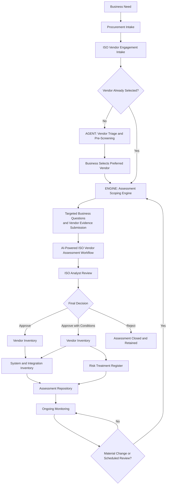

# VendorWise AI

## Enterprise Vendor Adoption Intelligence Platform

VendorWise AI is an AI-powered governance decision-support platform that helps organizations determine whether and how to safely adopt SaaS, AI, and third-party vendors.

Unlike traditional vendor risk tools that focus mainly on assessment and compliance evidence, VendorWise AI focuses on business enablement: helping Security, Privacy, Legal, Procurement, and business teams move faster while making explainable, risk-informed adoption decisions.

## Core Question

Should we adopt this vendor, and if yes, under what conditions?

## Key Capabilities

- Vendor adoption intake
- AI-assisted vendor evidence review
- Secure integration assessment across API, SFTP, SSO, SCIM, and production access
- Deterministic governance scoring logic
- Business impact translation
- Industry-aware risk interpretation
- Compensating control recommendations
- Human-in-the-loop approval workflow
- Executive-ready decision package

## Technology Stack

- Microsoft Copilot Studio
- Power Automate
- OpenAI API / Azure OpenAI
- Python governance logic
- SharePoint or Dataverse
- GitHub documentation

## MVP Scope

The MVP supports two paths:

1. Business is exploring vendors and needs guidance on which vendor may be safer to adopt.
2. Business has selected a vendor and needs a secure adoption decision with required conditions.

## Project Goal

To demonstrate how AI can help GRC, TPRM, Security, Privacy, Legal, and Procurement teams enable technology adoption securely, transparently, and efficiently.

## System Architecture

VendorWise AI supports the third-party risk lifecycle from procurement intake and vendor pre-screening through evidence-based assessment, human approval, and ongoing monitoring.

### Executive Workflow

### Detailed Architecture

- [Executive Workflow](docs/executive-workflow.md)
- [AI-Powered ISO Vendor Assessment Workflow](docs/ai-powered-iso-vendor-assessment-workflow.md)