# AI-Powered ISO Vendor Assessment Workflow

This workflow illustrates how VendorWise AI performs an evidence-first vendor security assessment by combining deterministic assessment scoping, AI-powered document analysis, targeted clarification questions, risk-treatment recommendations, and human review.

## Component types

- **Engine:** Python API - Applies deterministic rules to determine the assessment scope and evidence requirements.
- **Agent:** Open AI API - Uses AI to analyze documents, responses, gaps, and risk-treatment options.

## AI Agents

| AI Agent | Primary Role |
|----------|--------------|
| **1. Vendor Triage & Pre-Screening Agent** | Determines the assessment scope by evaluating the vendor, business use case, data sensitivity, integration type, applicable regulations, and required evidence. |
| **2. Response Analysis Agent** | Reviews questionnaire responses, identifies inconsistencies or missing information, and generates intelligent follow-up questions instead of relying on static questionnaires. |
| **3. Evidence Intelligence Agent** | Analyzes uploaded security documents (SOC 2, ISO 27001, ISO 42001, DPA, Privacy Policy, penetration test reports, etc.), extracts relevant controls, identifies gaps, and maps evidence to compliance frameworks. |
| **4. Gap Analysis & Risk Treatment Agent** | Combines business context, questionnaire responses, document analysis, and governance rules to identify control gaps, recommend compensating controls, assign a risk rating, and generate an onboarding recommendation (Approve, Approve with Conditions, or Reject). |

## Supporting Components (Non-AI)

| Component | Role |
|----------|------|
| **Power Automate** | Orchestrates the end-to-end workflow by coordinating AI agents, integrations, notifications, and approvals. |
| **Python Governance Engine** | Applies deterministic governance rules for inherent risk classification, vendor criticality, framework crosswalks, risk scoring, and approval thresholds. |
| **Human Reviewer** | Reviews AI-generated recommendations, validates findings, and makes the final vendor onboarding decision to ensure accountability and governance. |

- **System:** Dataverse API - Collects vendor evidence and business or vendor responses.
- **Human:** Validates the findings and produces the final assessment.

```mermaid
flowchart LR

A[ENGINE: Assessment Scoping Engine]

A --> B[Determine Applicable Assessment Domains]

B --> C[Determine Required Evidence]

C --> D[SYSTEM: Vendor Evidence Submission]

D --> D1[Third-Party Audit Reports]
D --> D2[Policies and Security Documentation]
D --> D3[Certifications and Attestations]
D --> D4[Other Supporting Evidence]

D1 --> E[AGENT: Evidence Intelligence Agent]
D2 --> E
D3 --> E
D4 --> E

E --> F[Analyze Vendor Documents]

F --> G[Map Evidence to Applicable Requirements]

G --> H[Identify Gaps, Missing Evidence, and Ambiguities]

H --> I[Generate Targeted Business and Vendor Questions]

I --> I1[How Will the Vendor Access or Receive Company Data?]
I --> I2[What Type of Data Will Be Accessed, Stored, or Processed?]
I --> I3[What Systems or Environments Are Involved?]
I --> I4[What Integration or Transfer Method Will Be Used?]
I --> I5[Clarify Evidence Gaps or Control Ambiguities]

I1 --> J[SYSTEM: Business and Vendor Responses]
I2 --> J
I3 --> J
I4 --> J
I5 --> J

J --> K[AGENT: Response Analysis Agent]

E --> L[AGENT: Gap Analysis and Risk Treatment Agent]
K --> L

L --> M[Consolidate Evidence and Response Findings]

M --> N[Recommend Risk Treatment Options]

N --> O[Translate Findings into Business Impact]

O --> P[HUMAN: ISO Analyst Review Workspace]

P --> Q[ISO Assessment Report]

Q --> R[Executive Decision Package]
```

## Workflow summary

1. The Assessment Scoping Engine determines the applicable assessment domains.
2. The vendor submits the required evidence.
3. The Evidence Intelligence Agent analyzes the documents and identifies relevant gaps.
4. The system generates targeted data-access, integration, and clarification questions.
5. The Response Analysis Agent evaluates the submitted answers.
6. The Gap Analysis and Risk Treatment Agent consolidates the findings.
7. The ISO analyst validates the results and prepares the final assessment.