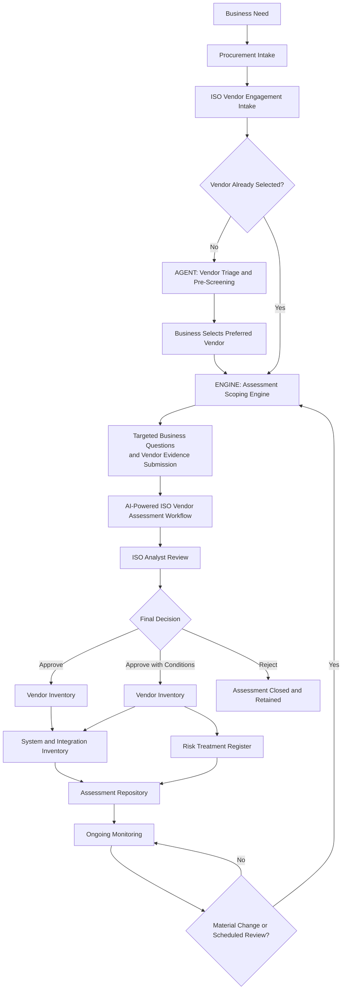

# VendorWise AI Executive Workflow

This workflow presents the end-to-end third-party risk lifecycle, from business need and procurement intake through vendor assessment, approval, monitoring, and reassessment.

## Component types

- **Agent:** Uses AI to perform analysis and recommendations.
- **Engine:** Applies deterministic rules and assessment logic.
- **Human:** Performs accountable review and decision-making.
- **System:** Stores records or manages workflow activities.

## Decision outcomes

- **Approve:** Add the vendor to the inventory, retain the assessment, and begin monitoring.
- **Approve with Conditions:** Add the vendor to the inventory and track outstanding actions in the Risk Treatment Register.
- **Reject:** Close and retain the assessment without onboarding the vendor.